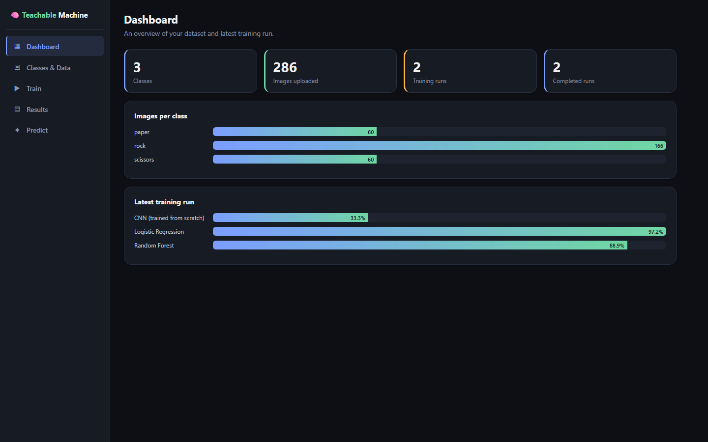

# Teachable Machine–Style Multi-Class Image Classifier

A local web app for building your own image classifier without writing ML code:
create classes, upload (or drag in) example images, train three different model
types side by side (Logistic Regression, Random Forest, CNN), then predict on
new images from a file upload or your webcam.

Built to the spec in `Rules.md` / `decisions.md` / `Blocked.md` — see those
files for the binding requirements, the architecture decisions and why, and
a log of assumptions made where the spec was silent.



## What's inside

- **Backend:** FastAPI (Python), real scikit-learn + TensorFlow/Keras models,
  SQLite for metadata, local filesystem for images/model artifacts.
- **Frontend:** React (loaded from CDN — no npm/build step required), talks to
  the backend over REST + a WebSocket for live training progress.

## Setup

Requires Python 3.10+.

```bash
cd teachable-machine
pip install -r requirements.txt
```

(If you're in an environment that requires it: `pip install -r requirements.txt --break-system-packages`.)

## Two frontends, one backend

There are two independent UIs, both talking to the same FastAPI backend —
pick whichever you prefer, or run both:

- **React** (`ui/index.html`) — served directly by the FastAPI app at `/`.
  No separate process needed.
- **Streamlit** (`streamlit_app.py`) — a second UI with the same four-tab
  flow (Classes & Data, Train, Results, Predict), including native webcam
  capture via `st.camera_input`. Since Streamlit has no WebSocket client, its
  Train tab polls the run status every 2 seconds instead of receiving pushed
  updates — same underlying progress data, different transport.

## Run (without Docker)

```bash
python3 -m uvicorn main:app --host 127.0.0.1 --port 8000
```

Then open **http://127.0.0.1:8000** for the React UI. Webcam capture requires
`localhost` or HTTPS — running as above on localhost satisfies that.

To also run the Streamlit UI, in a second terminal (same environment, backend
already running):

```bash
streamlit run streamlit_app.py
```

Open **http://127.0.0.1:8501**. If the backend isn't on `127.0.0.1:8000`, set
`API_BASE_URL` first, e.g. `API_BASE_URL=http://myhost:8000 streamlit run streamlit_app.py`.

## Run with Docker

```bash
docker compose up --build
```

This starts two containers from the same image: the FastAPI backend (with
the React UI) on **http://127.0.0.1:8000**, and the Streamlit UI on
**http://127.0.0.1:8501**, pre-wired to talk to the backend container. Both
share the same named volume (`classifier_storage`) so classes, images,
training runs, and model artifacts persist across restarts and are visible
from either UI.

To build/run without compose:

```bash
docker build -t teachable-classifier .
docker run -p 8000:8000 -v classifier_storage:/app/storage teachable-classifier
```

Webcam access over plain HTTP only works from `localhost`, so if you're
accessing the container from another machine you'll need to put it behind
HTTPS (e.g. a reverse proxy) for the webcam tab to work — file upload and
prediction work over plain HTTP regardless.

## Using the app

The UI has four tabs, meant to be used in order:

1. **Classes & Data** — Add at least 2 classes (e.g. "cat", "dog"). Click a
   class's upload box to add images (JPEG/PNG/WebP). Each class needs at
   least 10 images before training is allowed (configurable — see
   `data/validation.py:DEFAULT_MIN_IMAGES_PER_CLASS`). Invalid files are
   rejected individually with a reason; the rest of the batch still uploads.

2. **Train** — Click "Train" to train all three model types together. You'll
   see live progress bars and a log streaming over WebSocket as each model
   trains — including per-epoch progress for the CNN, and start/fit/done
   stage markers for the two scikit-learn models (their `.fit()` calls are
   atomic, so there's no per-step progress to report, only stage transitions).

3. **Results** — Pick a training run from the dropdown to see each model's
   held-out accuracy and confusion matrix (heatmap + raw counts). A model
   that failed to train shows its error here instead of being silently
   dropped.

4. **Predict** — Upload an image, or switch to webcam and click "Capture &
   predict" to grab a live frame. Either path sends the image to the same
   prediction endpoint and shows side-by-side predictions (with probability
   bars) from all three trained models at once. An unavailable model shows
   why instead of just disappearing.

## Getting a dataset in quickly

Two helper scripts in `scripts/` bulk-upload images via the same API the UIs
use, so you don't have to click through uploads one by one:

- **`scripts/upload_folder.py`** — point it at any local folder laid out as
  `dataset_root/<class_name>/*.jpg`, and it uploads everything. Works with
  most Kaggle datasets and any TFDS export as-is.

  ```bash
  python3 scripts/upload_folder.py /path/to/dataset_root
  ```

- **`scripts/download_rock_paper_scissors.py`** — downloads the Rock Paper
  Scissors dataset via `tensorflow_datasets` (3 balanced classes, good fit
  for this project's from-scratch CNN) and uploads a capped number of images
  per class directly.

  ```bash
  pip install -r requirements-optional.txt
  python3 scripts/download_rock_paper_scissors.py --limit-per-class 60
  ```

Both assume the backend is already running on `http://127.0.0.1:8000` (pass
`--api` to point elsewhere).

## Project structure

```
main.py           # FastAPI app: routes, orchestration, WebSocket broadcast.
                   # No ML logic lives here.
data/              # dataset ingestion, SQLite metadata, validation rules
trainers/          # one module per model type, common train()/progress interface
models/            # model artifact save/load only — no training logic
inference/         # prediction logic shared by upload and webcam paths
ui/                # React frontend (single HTML file, CDN-loaded React)
streamlit_app.py   # Streamlit frontend (alternative UI, same backend)
scripts/           # dataset bulk-upload helpers
storage/           # created at runtime: SQLite DB, uploaded images, model artifacts
docs/architecture.md
Dockerfile
docker-compose.yml
.dockerignore
```

See `docs/architecture.md` for how these modules fit together and the data
flow from upload through to prediction.

## Known limitations / documented deviations

- No GPU support; the CNN is a small from-scratch conv-net (not a frozen
  pretrained backbone) because this build environment has no network access
  to pretrained-weight hosts. See `decisions.md` D13/D14 for what would
  change if that access becomes available.
- Single-user, local-only (no auth, no per-user data isolation) — see
  `Blocked.md` B4.
- Capture-then-predict webcam mode only, not continuous live-stream
  predictions — see `Blocked.md` B6.

## Important: never commit `storage/`

`storage/` (the SQLite DB, uploaded images, and trained model files) is
runtime data and is gitignored. A previous commit accidentally included it,
which baked one machine's absolute file paths into the database — cloning
onto a different machine or OS broke every prediction and any retraining,
even though the files themselves were right there. See `decisions.md` D17
for the full story and the fix. If you're starting fresh, `storage/` is
created automatically on first run; there's nothing to set up.
